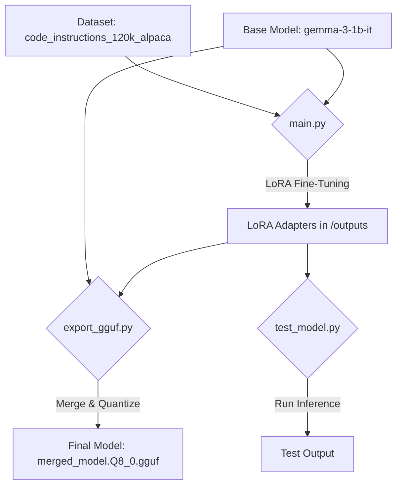

<div align="center">

# Fine-Tuning Gemma-3B for Code Generation 🐍

*A project demonstrating how to fine-tune the `unsloth/gemma-3-1b-it` model for Python code generation using Unsloth's optimized LoRA implementation.*

</div>


---

## 📋 Table of Contents
- [Overview](#-overview)
- [Model on Hugging Face](#-model-on-hugging-face)
- [Workflow](#-workflow)
- [🚀 Reproduce the Training](#-reproduce-the-training)
- [⚙️ Project Structure](#️-project-structure)
- [🧠 Fine-Tuning Methodology](#-fine-tuning-methodology)
  - [LoRA: Low-Rank Adaptation](#lora-low-rank-adaptation)
- [🔧 Configuration](#-configuration)
  - [Dataset Configuration](#dataset-configuration)
  - [Training Parameters](#training-parameters)
  - [LoRA Parameters](#lora-parameters)
- [🤝 Contributing](#-contributing)
- [📄 License](#-license)

---

## 📖 Overview

This repository provides a complete pipeline for fine-tuning a small, powerful language model (`gemma-3-1b-it`) to specialize in generating Python code. It leverages several key technologies:

- **Unsloth:** For a highly optimized training pipeline that enables up to 2x faster training and 60% less memory usage.
- **LoRA (Low-Rank Adaptation):** A parameter-efficient fine-tuning (PEFT) technique that dramatically reduces computational and storage costs.
- **GGUF:** The final model is exported to this format, making it highly portable and efficient for inference on a wide range of hardware.

## 🤗 Model on Hugging Face

The final GGUF model, as well as the LoRA adapters, are available for direct download from the Hugging Face Hub.

<a href="YOUR_HUGGING_FACE_MODEL_LINK_HERE" target="_blank">
    
</a>

## 📈 Workflow

The project follows a clear, three-step process from training to a deployable model.



## 🚀 Reproduce the Training

Assuming you have cloned the repository and installed the dependencies from `requirements.txt`, you can replicate the fine-tuning process with the following steps:

1.  **Prepare the Dataset:**
    Ensure your training data, `python-codes.json`, is in the project root. See the [Dataset Configuration](#dataset-configuration) section for details on the required format.

2.  **Run Fine-Tuning:**
    Execute the main training script. This will save the trained LoRA adapters in the `outputs/` directory.
    ```bash
    python main.py
    ```

3.  **Export to GGUF:**
    Merge the adapters with the base model and convert to GGUF.
    > **Note:** You may need to update the `model_name` path in `export_gguf.py` to point to your latest checkpoint from the `outputs/` directory.
    ```bash
    python export_gguf.py
    ```

4.  **Test the Model:**
    Run a quick inference test to validate the fine-tuned model.
    > **Note:** Like the export script, you may need to update the checkpoint path in `test_model.py`.
    ```bash
    python test_model.py
    ```

## ⚙️ Project Structure

-   `main.py`: The core script for fine-tuning the model.
-   `export_gguf.py`: Merges LoRA adapters and exports the model to the GGUF format.
-   `test_model.py`: A utility script to run inference for testing purposes.
-   `requirements.txt`: A list of all Python dependencies.
-   `python-codes.json`: The example training dataset.
-   `outputs/`: The default directory where trained model checkpoints (adapters) are saved.

---

## 🧠 Fine-Tuning Methodology

### LoRA: Low-Rank Adaptation

This project uses **LoRA (Low-Rank Adaptation)**, a technique that freezes the pre-trained model weights and injects trainable rank-decomposition matrices.

**Key Benefits:**
-   **High Efficiency:** Requires significantly less VRAM and trains much faster than full fine-tuning.
-   **Small Footprint:** The output is just the adapter weights (a few MBs), not a full model.
-   **Modularity:** Easily swap adapters to switch the model's specialized task.

The use of **Unsloth** further enhances this process, providing major speed and memory optimizations.

---

## 🔧 Configuration

### Dataset Configuration

To use your own data, you must format it as a JSON file containing a list of objects. Each object must have `instruction`, `input`, and `output` keys.

1.  **Example Format (`your_data.json`):**
    ```json
    [
      {
        "instruction": "Create a Python function to find the max of two numbers.",
        "input": "a = 10, b = 20",
        "output": "def max_num(a, b):\n  return max(a, b)"
      }
    ]
    ```

2.  **Update `main.py`:**
    Change the `load_dataset` call to point to your file:
    ```python
    # dataset = load_dataset("python-codes.json")
    dataset = load_dataset("path/to/your_data.json")
    ```

### Training Parameters

These are configured in the `TrainingArguments` object in `main.py`.

| Parameter | Value | Description |
| :--- | :--- | :--- |
| `per_device_train_batch_size`| `2` | Number of samples per GPU per batch. |
| `gradient_accumulation_steps`| `4` | Steps to accumulate gradients for a larger effective batch size (8). |
| `warmup_steps` | `10` | Steps for a learning rate warm-up phase to stabilize training. |
| `num_train_epochs` | `3` | Total number of times to iterate over the dataset. |
| `learning_rate` | `2e-4` | The starting learning rate. |
| `optim` | `"adamw_8bit"` | Memory-efficient AdamW optimizer. |
| `output_dir` | `"outputs"` | Directory to save model checkpoints. |
| `save_strategy` | `"epoch"` | Save a checkpoint at the end of each epoch. |

### LoRA Parameters

These are configured in the `setup_lora` function in `main.py`.

| Parameter | Value | Description |
| :--- | :--- | :--- |
| `r` | `64` | The rank of the LoRA matrices. Higher means more capacity. |
| `lora_alpha` | `128` | The scaling factor for the LoRA updates (typically `2 * r`). |
| `target_modules` | `[...]` | The specific model layers (e.g., `q_proj`, `v_proj`) to apply LoRA to. |
| `lora_dropout` | `0` | Dropout rate for LoRA layers. `0` is optimized in Unsloth. |
| `bias` | `"none"` | Specifies that bias parameters are not trained (an Unsloth optimization). |

---

## 🤝 Contributing

Contributions are welcome! Please feel free to submit a pull request or open an issue if you have suggestions for improvements.

1.  Fork the Project
2.  Create your Feature Branch (`git checkout -b feature/AmazingFeature`)
3.  Commit your Changes (`git commit -m 'Add some AmazingFeature'`)
4.  Push to the Branch (`git push origin feature/AmazingFeature`)
5.  Open a Pull Request

## 📄 License

This project is distributed under the MIT License. See `LICENSE` for more information.
